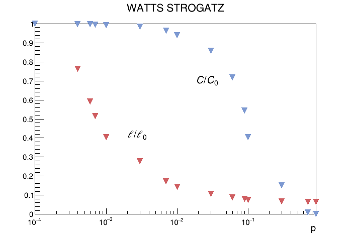
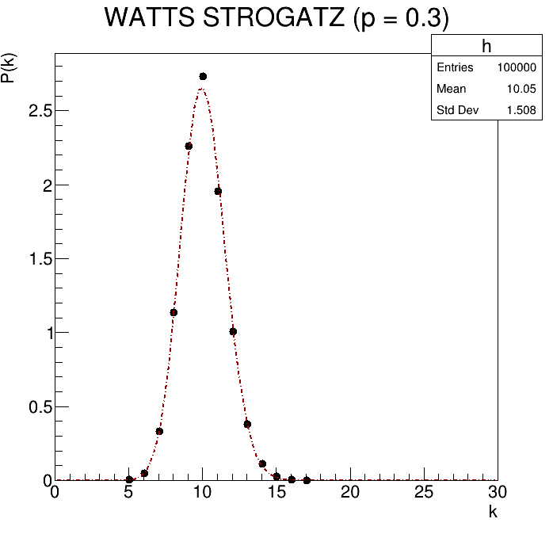
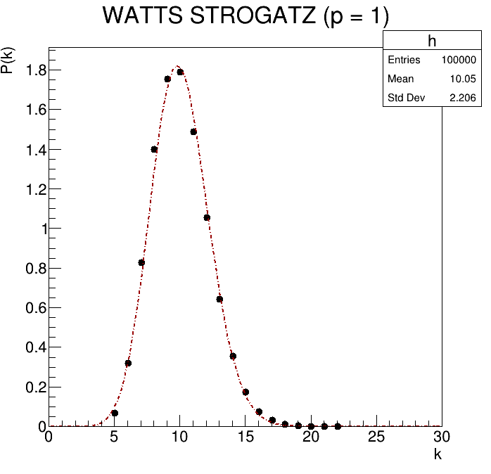
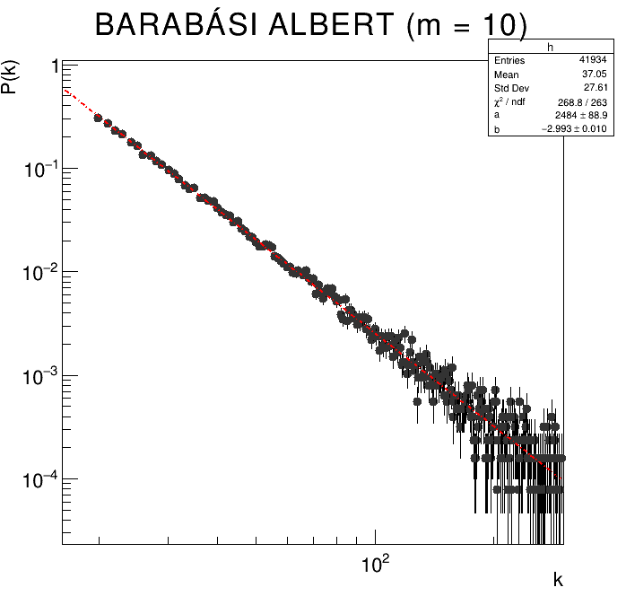
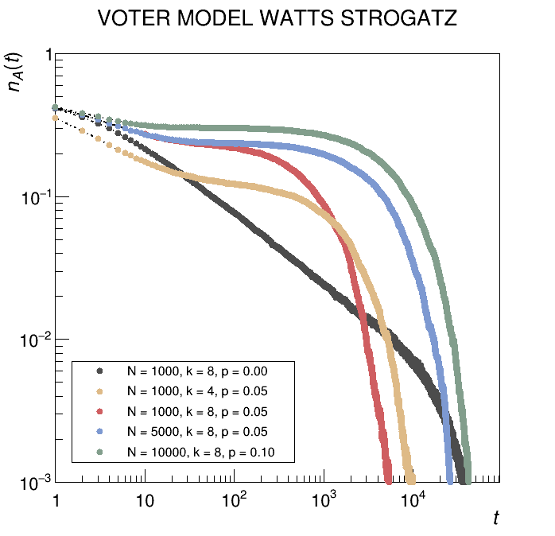
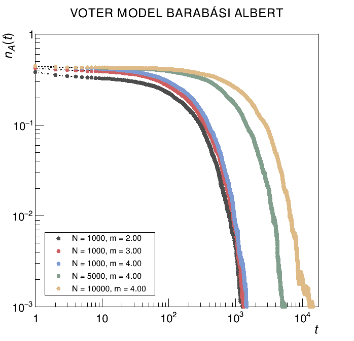
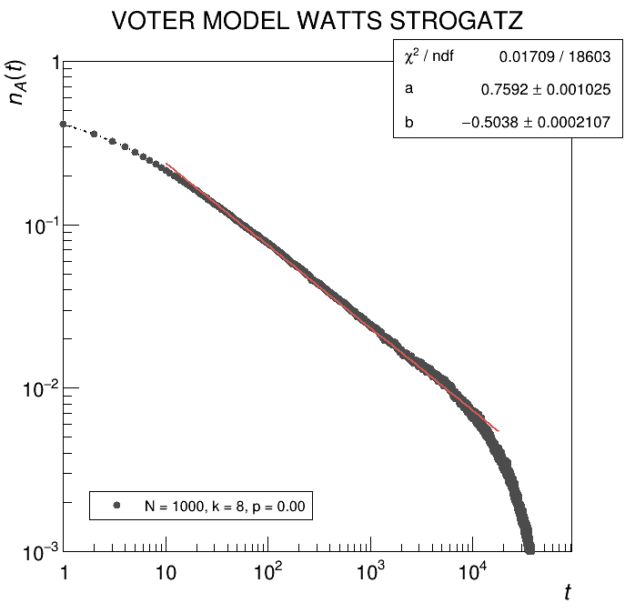
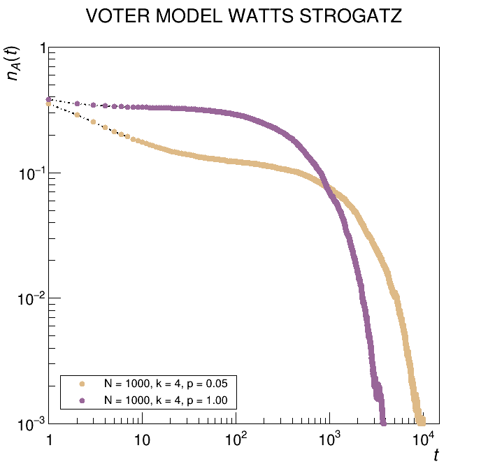

# voter model on complex networks
* regular network. 
* random network. 
* small-world network. 
* scale-free network.


## code structure

```cpp
class vertex_graph;
class undirected_graph;
class watts_strogatz;
class barabasi_albert;
class voter_model;
```

## structural properties 

### clustering, path length (watts strogatz)

 <div align="center"> </div>   

## degree distribution


| **(a) Small-world network** |  <div align="center">**(c) Random network**</div>   |  **(b) Scale-free network** |
| --------- | --------- | --------- |
|  |   |  |


## interface density

| **(a) Regular & small-world network** |  **(b) Scale-free network** |
|----------|----------|
|  |  |
|  <div align="center">**(c) Power law, regular network**</div>  |  <div align="center">**(d) Random & small-world network**</div>  |
|  |   |

## voter model & network construction

  <a href="https://www.youtube.com/watch?v=CQm6hIXjis8">
    
  </a>

